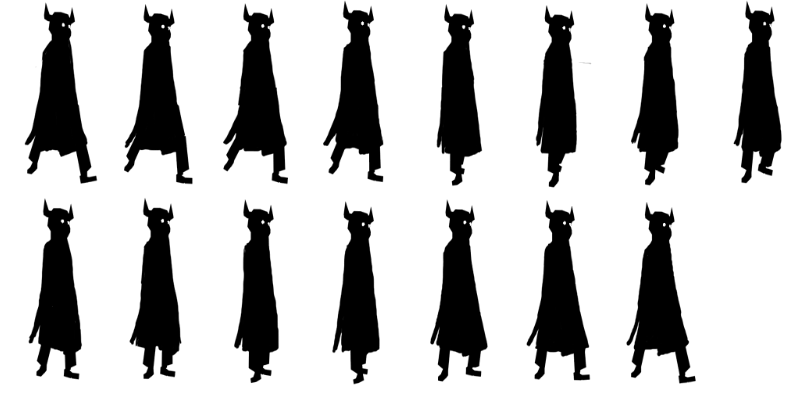
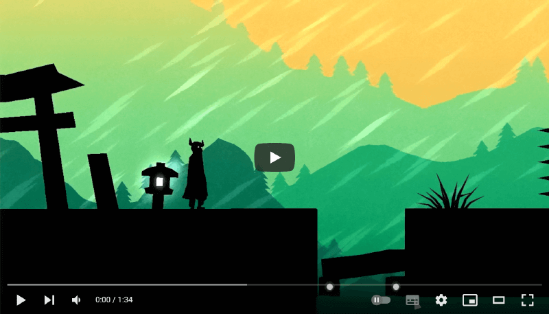

# Der Erlkoenig

Game prototype made for a TIGSource.com contest in 2010, inspired by the famous German tale : _Der Erlkönig_.

The game is implemented in [Squirrel](https://github.com/albertodemichelis/squirrel), based on a the [GameStart3D](https://www.youtube.com/@GameStart3D/videos) engine.

 
_Research for a character design_

 

In october 2008, the :tiger: TigSource community organized an online game jam (known as _TIGSource Contest_) titled **Commonplace Book Competition**.

> The theme of the game (was) H.P. Lovecraft's Commonplace Book. This was a notebook in which Lovecraft jotted down his various ideas, many of them disjointed and cryptic; most of these musings never became real stories.

## My game prototype

> Narrator walks along unfamiliar country road,—comes to strange region of the unreal.

For this gameplay, I chose to immerse the main character (“the narrator”) in an environment that would be entirely ruled by a physics engine. While the player doesn't directly control the main character, their task is to facilitate the progression along a course (“unfamiliar country road”) with deadly obstacles. The player, by interacting with certain elements of the environment, can move them or make them disappear. The usage of physics is a major challenge in terms of character control (we can only act indirectly on the velocity of moving objects) and because as soon as a coherent set has been put in place the interactions between each elements of gameplay happen autonomously.

## Visual parti pris

To convey the sense of an inescapable circumstance, I drew inspiration from the [Erlkönig for trumpet in B flat major, narrator and piano, by Michael T. OTTO](http://www.musicweb-international.com/classrev/2004/Mar04/otto.htm). Although not directly related to the idea quoted by the Commonplace Book, the mythology of the Erlkönig carries a universe from which I could draw a strong graphic principle of shadows, both simple and adapted in the very short development cycle imposed by the TigSource competition.

## Mockups and visual experiments

 
_Color mockup for the parallax scrolling background_

 

 
 
_Mockups for a level design, using more or less complex shapes. Each type of brick is driven by the physics engine._

 

 
_Walk cycle for the main character_

### Video capture of the latest prototype

